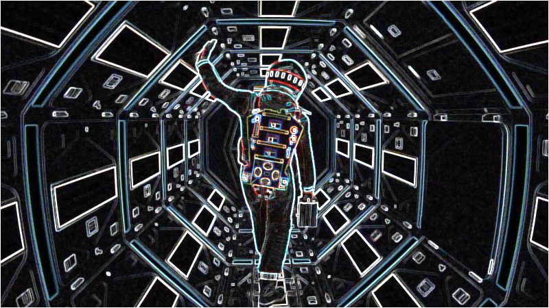
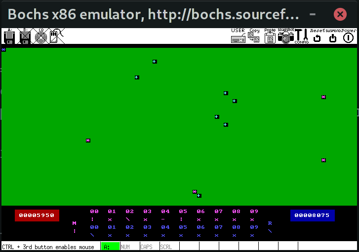

# TP1

Tp para aprender assembler x86 64bits para linux, manejar memoria, llamadas desde C, llamar a funciones de C, convenciones de C, representación de datos (int/floats/strings).

# TP2

Realizar filtros de imágenes en assembler para el aprendisaje de las instrucciones de SIMD y compararlas con el rendimiento contra las versiones en C.

# TP3

Proceso de prendido del CPU, pasar a modo protegido, paginación, mini kernel, creación de tareas de nivel usuario, scheduler básico, switch de tareas con TSS de intel, interrupciones, todo en 32bits por simplicidad.

